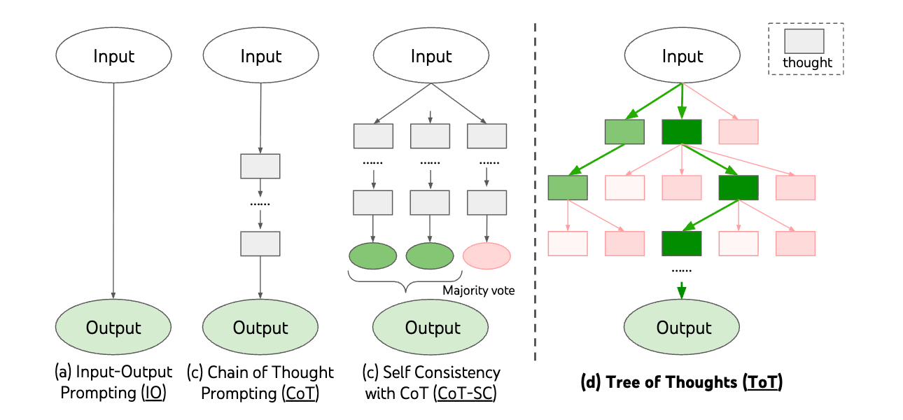

# <div align="center">ToT-Unit<div>

<p align="center">

</p>

### Install

```bash
pip install git+ssh://git@github.com/CHyfuture/tot-unit.git
```

### Quick Demo

```bash
# shared key/base
export TOT_API_KEY=sk-...
export TOT_API_BASE=...

# separate keys (optional)
export TOT_GEN_API_KEY=sk-...
export TOT_JUDGE_API_KEY=sk-...
export TOT_GEN_API_BASE=...
export TOT_JUDGE_API_BASE=...

bash scripts/text/bfs_demo.sh
```

The demo script calls `examples/text_bfs_demo.py`.

### BFS Flow With Beam Pruning

```
step 0:
  current: [root]
    └─ generate -> candidates: [c1, c2, c3, c4, ...]
        └─ evaluate -> scores
            └─ select top2 -> [a, b]

step 1:
  current: [a, b]
    ├─ generate from a -> [a1, a2, a3, ...]
    ├─ generate from b -> [b1, b2, b3, ...]
    └─ merge -> candidates: [a1, a2, ..., b1, b2, ...]
        └─ evaluate -> scores
            └─ select top2 -> [x, y]

final:
  [x, y]
```

### Example

```python
# Creative Writing
from dataclasses import dataclass

from tot_unit.core import Candidate
from tot_unit.core.selectors import GreedySelector
from tot_unit.core.stoppers import MaxStepStopper
from tot_unit.llm import LLMConfig
from tot_unit.llm_tot import LLMToT, LLMToTConfig, LLMToTStepConfig


@dataclass(frozen=True)
class TextState:
    prompt: str
    text: str


COT_PROMPT = (
    "Write a coherent passage of 4 short paragraphs. "
    "The end sentence of each paragraph must be: {input}\n\n"
    "Make a plan then write. Your output should be of the following format:\n\n"
    "Plan:\nYour plan here.\n\n"
    "Passage:\nYour passage here.\n"
)

VOTE_PROMPT = (
    "Given an instruction and several choices, decide which choice is most promising. "
    'Analyze each choice in detail, then conclude in the last line "The best choice is {s}", '
    "where s is the integer id of the choice.\n"
)


def _prompt_builder(step, cand):
    return COT_PROMPT.format(input=cand.state.prompt) + cand.text


def _vote_prompt_builder(step, candidates):
    prompt = VOTE_PROMPT
    for i, cand in enumerate(candidates, 1):
        prompt += f"Choice {i}:\n{cand.text}\n"
    return prompt


def _stop_provider(step, cand):
    return "\nPassage:\n" if step == 0 else None


prompt = "I went to the park yesterday."
initial = [Candidate(state=TextState(prompt=prompt, text=""), text="")]

gen_cfg = LLMConfig(api_key="<KEY>", api_base="<BASEURL>", model="<MODEL>", temperature=0.7)
judge_cfg = LLMConfig(api_key="<KEY>", api_base="<BASEURL>", model="<MODEL>", temperature=0.0)

llm_tot = LLMToT(
    cfg=LLMToTConfig(
        steps=2,
        n_generate=5,
        n_select=1,
        n_evaluate=5,
        step_llms=[
            LLMToTStepConfig(gen=gen_cfg, judge=judge_cfg),
            LLMToTStepConfig(gen=gen_cfg, judge=judge_cfg),
        ],
        prompt_builder=_prompt_builder,
        vote_prompt_builder=_vote_prompt_builder,
        stop_provider=_stop_provider,
    ),
    selector=GreedySelector(),
    stopper=MaxStepStopper(max_step=1),
)

result = llm_tot.run(initial_candidates=initial)
print(result.final_candidates[0].text)
```

### Execution Flow

1. `Generator.generate` produces candidates
2. `Evaluator.evaluate` scores candidates
3. `Selector.select` keeps the selected candidates
4. `Stopper.should_stop` decides whether to stop
5. Selected candidates flow into the next step

### Core Data Structure

`Candidate` is the object passed through the pipeline:

- `text`: current candidate text
- `state`: your intermediate state (any structure)
- `meta`: optional metadata (logging/debugging)

If later steps depend on earlier outputs, put the dependency in `Candidate.state`.

### Interfaces (Inputs/Outputs)

- `Generator.generate(step, current, n_generate) -> list[Candidate]`
  - Input: current candidates `current`
  - Output: next-step candidates
- `Evaluator.evaluate(step, candidates, n_evaluate) -> list[float]`
  - Input: candidate list
  - Output: scores aligned to candidates (higher is better)
- `Selector.select(candidates, scores, n_select) -> list[Candidate]`
  - Input: candidates + scores
  - Output: selected candidates
- `Stopper.should_stop(step, selected, scores) -> bool`
  - Input: selected candidates and scores
  - Output: whether to stop

### How to Apply in Your Task

1. Define your `Candidate.state` (what needs to be carried forward)
2. Implement or reuse `Generator / Evaluator / Selector / Stopper`
3. Set `steps / n_generate / n_select / n_evaluate`
4. Call `run(initial_candidates=...)`

